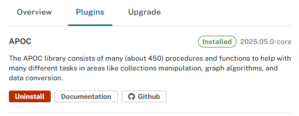

# Handover LLM

## 外部連結

- [Ollama](https://ollama.com/download/windows)
- [Neo4j Desktop](https://neo4j.com/download/)
- [Python](https://www.python.org/downloads/)

---

## 目錄
1. [簡介](#簡介)
2. [安裝 Ollama 及 LLM](#安裝-ollama-及-llm)
3. [安裝 Neo4j Desktop](#安裝-neo4j-desktop)
4. [Ollama + Neo4j 知識圖與問答教學](#ollama--neo4j-知識圖與問答教學)

---

## 簡介

本教學示範如何利用 **LangChain + Neo4j + Ollama**，將一篇 PDF 論文轉換為**知識圖**與**向量索引**，並實現問答。
- 建議 **Python** 使用 ``virtualenv`` 套件或其他虛擬環境套件管理環境。
- 若電腦容量不足請下載較小的模型，否則運行後將有極大機率出現電腦死機情況。

---

## 安裝 Ollama 及 LLM

#### 1. 下載並安裝 [Ollama](https://ollama.com/download/windows)
#### 2. 確認安裝完成
```bash
ollama help
```
#### 3. 將 LLM 及向量嵌入模型下載至本地
```bash
ollama pull llama3
ollama pull mxbai-embed-large
```
#### 4. 確認模型下載完成
```bash
ollama list
```
#### 5. 執行模型測試
```bash
ollama run llama3
```
---

## 安裝 Neo4j Desktop

#### 1. 下載並安裝 [Neo4j Desktop](https://neo4j.com/download/)


#### 2. 創建新的 Instance
    - 需輸入 Instance 名稱、帳號、密碼

#### 3. 啟動後點擊右側設定新增 **Plugins**


#### 4. 下載 **APOC** 套件
    - **APOC** 是 Neo4j 官方維護的功能擴充套件 (plugin)，全名為 **Awesome Procedures On Cypher**。
    - 它提供了大量的 **procedure** 與 **function**，讓 Cypher 查詢語言能處理更多資料操作、整合與分析工作。


---

## Ollama + Neo4j 知識圖與問答教學

#### 1. 安裝必要套件
- 本機需啟動 **Ollama**
- 本機需執行 **Neo4j**（Bolt 連線埠 7687，並允許寫入）
``` python
pip install pymupdf langchain langchain-core langchain-community langchain-ollama langchain-text-splitters langchain-experimental neo4j
```

#### 2. 匯入 PDF 資訊

- 程式 `code\import.py` 負責：
    1. **讀取 PDF 全文並分段**
    2. **建立向量索引（全量 chunks）**
    3. **將部分 chunks 抽取為知識圖（限額/分批）**

- 其中：
    ``` python
    import os, time, fitz
    from langchain_core.documents import Document
    from langchain_ollama import ChatOllama, OllamaEmbeddings
    from langchain_text_splitters import RecursiveCharacterTextSplitter
    from langchain_experimental.graph_transformers import LLMGraphTransformer
    from langchain_neo4j import Neo4jGraph
    from langchain_community.vectorstores import Neo4jVector
    ```
    - **fitz**：用來讀取 PDF 文字。
    - **RecursiveCharacterTextSplitter**：將全文切割成小段，避免超過 LLM 限制。
    - **OllamaEmbeddings**：將文字轉換成向量，方便做語意檢索。
    - **Neo4jVector.from_texts**：把所有 chunks 存進 Neo4j，並建立向量/全文索引。
    - **LLMGraphTransformer**：讓 LLM 從文字中抽取結構，轉換成知識圖節點與關係。

- 關於可調整參數設定：
    ``` python
    CHUNK_SIZE = 800
    CHUNK_OVERLAP = 120
    GRAPH_CHUNK_CAP = 200
    GRAPH_BATCH_SIZE = 50
    ```
    - `CHUNK_SIZE = 800`：每個切分後的文字塊（chunk）大約包含 800 個字元（包含空白與符號）。避免把太大的段落直接丟給 LLM（會超過上下文限制），同時確保每塊文字夠長，能保留語意完整性。如果想讓檢索結果更精確，可以設小一點（300~500）。
    - `CHUNK_OVERLAP = 120`：相鄰 chunks 之間的重疊字元數。避免重要內容剛好切斷在兩個 chunk 交界，導致語意斷裂。
    - `GRAPH_CHUNK_CAP = 200`：最多抽取多少段文字（chunks）來建立知識圖（Graph）。因為 LLM 做結構化抽取（轉成節點/關係）很耗時，限制上限避免整本論文都要跑，太慢或太貴。此設定只會用前 200 段去建圖，但是**向量索引仍包含全部 chunks**，所以檢索完整性不受影響。
    - `GRAPH_BATCH_SIZE = 50`：每次送多少 chunks 給 LLM 做圖譜抽取。避免一次送太多段，導致 LLM 上下文爆掉或速度變慢。

#### 3. 對已匯入資訊問答

- 程式 `code\ask.py` 負責：
    1. **直接使用既有 Neo4j 索引與知識圖**
    2. **繁體中文回答**

- 其中：
    ``` python
    from langchain_core.prompts import ChatPromptTemplate
    from langchain_core.runnables import RunnablePassthrough
    from langchain_core.output_parsers import StrOutputParser
    from langchain_ollama import ChatOllama, OllamaEmbeddings
    from langchain_experimental.llms.ollama_functions import OllamaFunctions
    from langchain_neo4j import Neo4jGraph
    from langchain_community.vectorstores import Neo4jVector
    ```
    - **Neo4jVector.from_existing_graph**：直接使用已存在的索引，不會重建。
    - **OllamaFunctions**：用來抽取實體，方便查 Neo4j 的關係。
    - **ChatPromptTemplate**：設計 Prompt，固定要求「一律繁體中文回答」。
    - **Retriever**：同時從向量檢索與知識圖檢索內容。

### 執行流程

#### 1. 首次使用

- 會建立 `Document` 節點、向量索引 `pdf_chunks_vec`、全文索引。
`pdf_chunks_kw`。
``` bash
python import.py
```

#### 2. 後續使用

- 啟動互動式問答。
``` bash
python ask.py
```

### 常見問題

#### 1. 報錯 `Vector and keyword index don't index the same node label`
- 向量索引與全文索引的 **node_label 不一致**。請確認：
    - 都是 `:Document`
    - 屬性一致（`text`）
- 必要時到 Neo4j Browser 執行：
    ``` cypher
    SHOW INDEXES;
    DROP INDEX <舊索引名稱>;
    ```
- 再用 `import.py` 重建。

#### 2. 報錯 `ValueError: Could not use APOC procedures. Please ensure the APOC plugin is installed in Neo4j and that 'apoc.meta.data()' is allowed in Neo4j configuration`
- Neo4j Instance 找不到 `apoc.meta.data()` 這個 procedure。通常有幾種原因：
    - 沒安裝 APOC（或版本不相容）
    - APOC 有裝，但連到錯的資料庫（例如連到 system 而不是 neo4j）
    - 有裝 APOC，但 neo4j.conf 沒允許該 procedure
    - 用的是 Aura／受限環境，但該 procedure 不可用
- **解 1**：安裝對應版本的 APOC Core
    - 開 Neo4j Desktop → DB → Plugins → 安裝 APOC（版本要跟 Neo4j 主版一致，例如 Neo4j 5.22 就用 5.22 的 APOC）。
    - 若是手動部署：下載對應版 `apoc-<version>-core.jar` 放進 `plugins/`。
- **解 2**：neo4j.conf 設定允許（至少 allowlist，必要時加 unrestricted）
    - 打開 neo4j.conf（Windows 預設在 C:\Users\<User>\AppData\Local\Neo4j\Relate\Data\dbmss\<db id>\conf\neo4j.conf），加入／確認：
        ```ini
        dbms.security.procedures.allowlist=apoc.*
        dbms.security.procedures.unrestricted=apoc.*
        apoc.import.file.enabled=true
        apoc.export.file.enabled=true
        ```
    - 存檔後重啟 Neo4j。